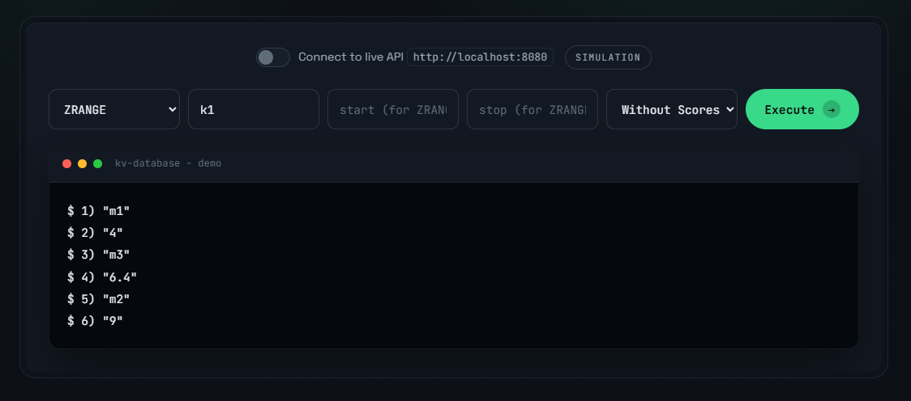

# KV-Database

KV-Database is a lightweight, in-memory key-value database written in Rust, with support for both plain key-value pairs and ordered (sorted-set) data. It exposes a Redis-like command set over a TCP server, persists every write to a write-ahead log for durability, and periodically snapshots the full dataset so the log can be truncated and replayed quickly on restart. Designed as a learning project, KV-Database focuses on building a small but complete storage engine: from a custom skip list and LRU cache, through log encoding and crash recovery, to a clean HTTP API wrapper for easy integration.

## Try the interactive demo

**The fastest way to understand this project is to use it.** Open the showcase site and run all ten commands directly in your browser, no install or setup required. It runs a faithful in-browser simulation of the real engine, and can also connect to a live local instance over the HTTP API.

> **Live demo:** open [`kv-database-showcase.html`](kv-database-showcase.html) in any browser.

<!-- [insert image: screenshot or GIF of kv-database-showcase.html - the dark-tech showcase with the interactive terminal demo running a ZRANGE command. Recommended: 1600x900, saved to docs/showcase.png] -->


The showcase is a hand-built, single-file site (vanilla HTML/CSS/JS, no framework) with:

- A **live interactive demo** of every command, with a terminal-style interface that mirrors the real server's exact output format (`VALUE`, `NIL`, `OK`, numbered `ZRANGE` rows, and so on)
- A **simulation mode** that works offline with zero setup, plus a one-click **live API mode** that talks to a running instance on `localhost:8080`
- A dark-tech design with a full architecture walkthrough and real Rust snippets from the engine

## Features

- Key-value storage with `GET`, `SET`, `DEL`, `EXISTS`, `DBSIZE`, and `CLEAR`
- Sorted sets with `ZADD`, `ZSCORE`, `ZREM`, and `ZRANGE` (with optional scores)
- Durable writes via a checksummed write-ahead log (WAL)
- Automatic periodic snapshotting that truncates the WAL on restart
- LRU caching on top of the hash map for faster hot-key access
- Sorted sets backed by a custom skip list with O(log n) insert, remove, and range queries
- TCP server for direct client access
- HTTP API wrapper (Axum) exposing the same commands as JSON
- Interactive showcase website with a live, in-browser demo of every command

## Tech Stack

**Language** - Rust

**Runtime** - Tokio (async TCP server, async file I/O)

**Web** - Axum (HTTP API), vanilla HTML/CSS/JavaScript (showcase)

**Data structures** - Custom skip list, LRU cache, hash maps

**Dependencies** - `serde`/`serde_json`, `ordered-float`, `crc32fast`, `chrono`, `rand`

## Technical Highlights

This project focuses on building a small, understandable storage engine while keeping the system durable and recoverable. Some key implementation details include:

- Write-ahead logging with per-record CRC32 checksums, so torn or corrupted log entries are detected and skipped during replay
- Snapshotting that dumps the full dataset atomically (via a temp file + rename), then truncates the WAL
- A custom skip list for sorted sets, with rank tracking and span fields to support efficient `ZRANGE` queries
- An LRU cache layered over the key-value hash map, with hit/miss statistics
- A TCP connection model alongside a single shared async engine, so all access is serialized through one lock

## Challenges

The primary learning curve in this project was implementing crash-safe persistence from scratch. Getting the snapshot correct and truncating the WAL, as well as making replay tolerant of partially written records, was particularly challenging and required careful thought. The skip list, with its randomized levels, spans, and rank tracking for range queries, was also a substantial piece of custom data-structure work to get right.

## Installation

```
git clone https://github.com/francis-chung/kv-database.git
cd kv-database

cargo build
```

Build requires the Rust toolchain (2024 edition). A dev container is provided for a ready-made environment:

```
devcontainer up
```

## Usage

Start the server:

```
cargo run
```

This launches two servers on `127.0.0.1`:

- **TCP server** - `127.0.0.1:7878`, speaking the Redis-like line protocol
- **HTTP API** - `127.0.0.1:8080`, POST to `/api/command` with a JSON body

Then open [`kv-database-showcase.html`](kv-database-showcase.html) and toggle **live mode** to drive the running server from the browser demo.

### TCP examples

```
SET foo bar
OK

GET foo
VALUE bar

ZADD myset alice 1.5
OK
ZRANGE myset 0 -1 WITHSCORES
1) "alice"
2) "1.5"

DBSIZE
1
```

### HTTP example

```bash
curl -X POST http://127.0.0.1:8080/api/command \
  -H "Content-Type: application/json" \
  -d '{"key":"foo","value":"bar"}'
```

## Future Improvements

- Expiration / TTL on keys
- Persistence options beyond the WAL + snapshot model (e.g. a background compaction engine)
- More sorted-set commands (`ZRANK`, `ZINCRBY`, `ZPOPMIN`/`ZPOPMAX`)
- Cluster / replication support
- A real RESP protocol parser instead of the simple line protocol

## License

This project is licensed under the [MIT](blob/main/LICENSE) license.
